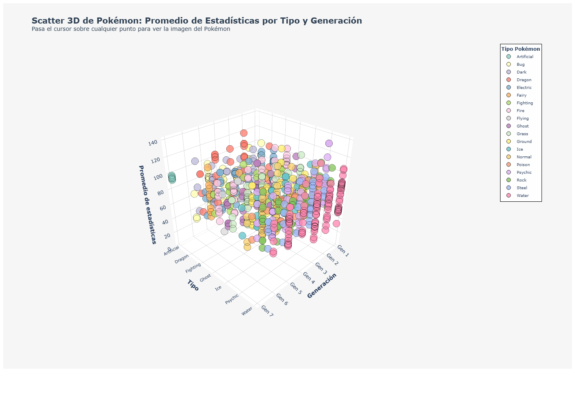
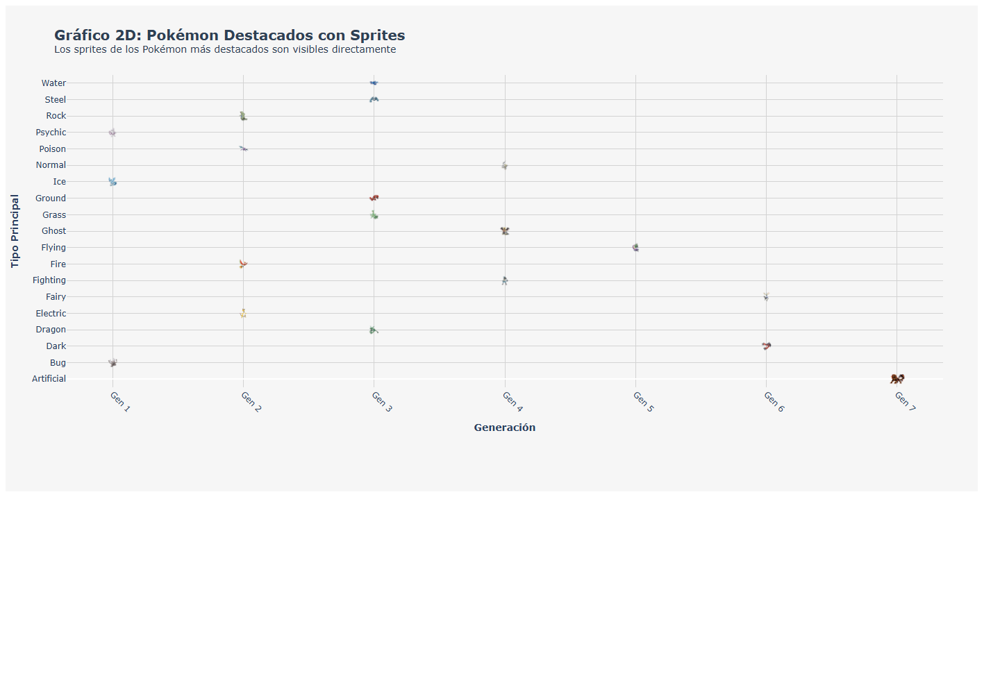
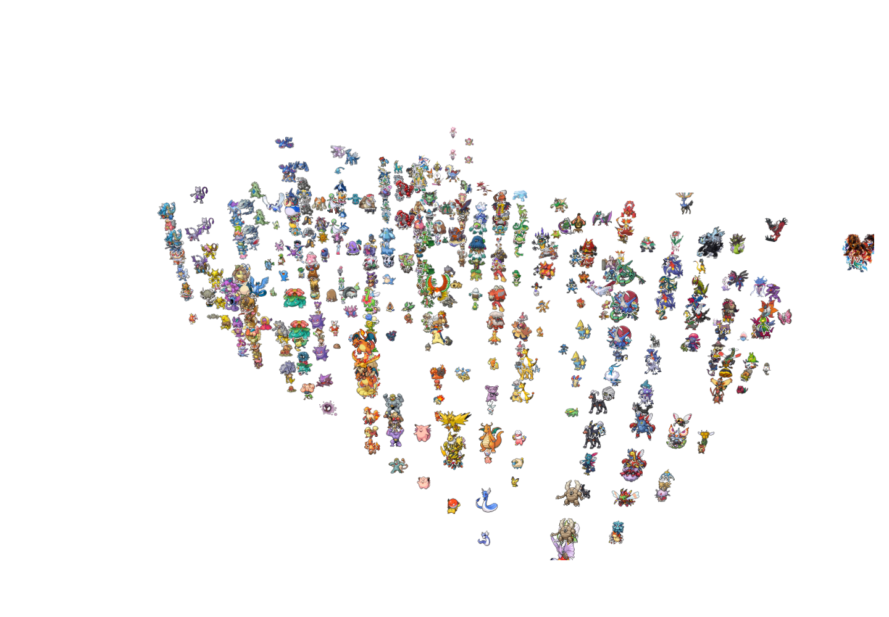

# Práctica 10: visualización de Pokémon con scatter plots

Esta práctica presenta visualizaciones interactivas de las estadísticas de Pokémon mediante gráficos de dispersión 2D y 3D. Los datos se obtienen de [`Pokemon_Evolution_Stages.csv`](../Practice-05/Pokemon_Evolution_Stages.csv), incluyendo la generación, el tipo principal, la etapa evolutiva y el promedio de las estadísticas de combate.

## Tecnologías utilizadas

- Python y Jupyter Notebook
- Pandas y NumPy
- Plotly
- PyDeck
- Matplotlib

## Evidencias de las gráficas

### Scatter 3D por tipo y generación

El gráfico relaciona la generación, el tipo principal y el promedio de estadísticas. La leyenda incluye el tipo `Artificial` y el eje de generaciones contempla la generación 7.



Archivo interactivo: [`scatter_3d_pokemon_con_imagenes.html`](scatter_3d_pokemon_con_imagenes.html)

### Scatter 2D con sprites

Esta vista coloca directamente los sprites de los Pokémon destacados. En la parte inferior derecha se encuentran las criaturas artificiales correspondientes a la generación 7.



Archivo interactivo: [`grafico_2d_sprites.html`](grafico_2d_sprites.html)

### Visualización 3D con PyDeck

La vista orbital representa cada registro mediante su sprite y permite explorar la distribución completa de los Pokémon. Los sprites artificiales se cargan desde los recursos locales de esta práctica.



Archivo interactivo: [`pokemon_3d_pydeck.html`](pokemon_3d_pydeck.html)

## Pokémon artificiales incorporados

El DataFrame contiene cinco criaturas artificiales de generación 7. Para evitar referencias inexistentes en PokeAPI, cada una cuenta con una ilustración original almacenada en [`assets/artificial_pokemon`](assets/artificial_pokemon):

| ID | Nombre | Tipo secundario | Evolución | Sprite |
|---:|---|---|---:|---|
| 722 | Kitsunari | Fire/Psychic | 3 |  |
| 723 | Nahualix | Psychic/Ghost | 3 |  |
| 724 | Tezcatlipoca | Fire/Dark | 3 |  |
| 725 | Tenochtl | Grass/Flying | 3 |  |
| 726 | Onigiri no Kage | Water/Steel | 2 |  |

## Ejecución

Desde la raíz del repositorio, activa el entorno virtual con:

```powershell
.\Practice-06\env\Scripts\Activate.ps1
```

Si la terminal se encuentra dentro de `Practice-10`, utiliza:

```powershell
..\Practice-06\env\Scripts\Activate.ps1
```

Después abre Jupyter Lab:

```powershell
jupyter lab
```

Finalmente, abre [`explot.ipynb`](explot.ipynb) y ejecuta las celdas en orden. Los archivos HTML se generan dentro de `Practice-10` y pueden abrirse en cualquier navegador moderno.

> Las capturas de este documento funcionan como evidencia estática. Para utilizar rotación, filtros y tooltips, abre los archivos HTML interactivos.
